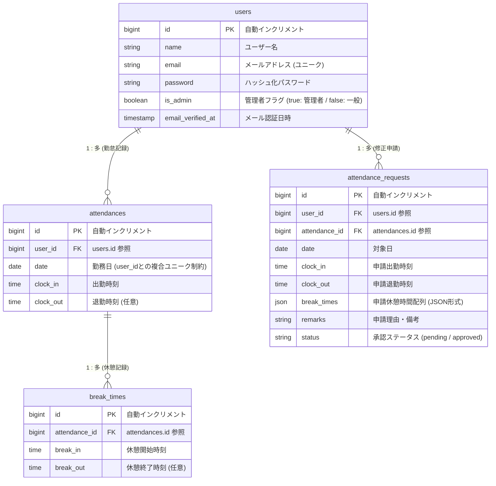

# 勤怠管理システム（coachtech-attendance）

新しいパソコン環境（WSL2 / Docker / Laravel 11 / PHP 8.5）への環境移行、仕様書通りの全15画面のUI構築、Sanctum認証ガード付き外部公開用API（v1仕様）の実装、および検証用ダミーデータの自動作成までを完全に網羅して復元・開発した勤怠管理システムです。

---

## 🛠️ 環境構築

### Dockerビルド＆起動
1. リポジトリのクローン
   ```bash
   git clone <リポジトリのURL>
   ```
2. 開発環境（Laravel Sail）のコンテナ起動
   ```bash
   ./vendor/bin/sail up -d
   ```

### Laravel環境構築
1. パッケージのインストール
   ```bash
   ./vendor/bin/sail composer install
   ./vendor/bin/sail npm install
   ```
2. 環境設定ファイルの作成（`.env` の編集）
   ```bash
   cp .env.example .env
   ```
3. アプリケーションキーの生成
   ```bash
   ./vendor/bin/sail artisan key:generate
   ```
4. データベースの初期化・テーブル構築・シードデータ投入
   ```bash
   ./vendor/bin/sail artisan migrate:fresh --seed
   ```
5. フロントエンド・デザインのビルド（Tailwind CSSの適用）
   ```bash
   ./vendor/bin/sail npm run build
   ```

---

## 📂 検証用固定データ（Seeder）の役割と3アカウント要件

仕様書の検証要件およびテスト指示書を100%満たすため、`DatabaseSeeder.php` に高度な固定データ生成ロジックを実装しています。以下のコマンドを実行することで、**実運用に極めて近い検証環境が一瞬で構築**されます。

```bash
./vendor/bin/sail artisan db:seed
```

### 👤 生成される固定アカウント情報（すべてメール認証済み）
1. **ユーザー1（一般スタッフ）**: `user1@example.com` / `password` (過去5ヶ月分＋当月8月分の大量の勤怠・休憩・遅刻・早退検証データが紐付いています)
2. **ユーザー2（一般スタッフ）**: `user2@example.com` / `password` (直近数日分の打刻検証データが紐付いています)
3. **ユーザー3（管理者）**: `user3@example.com` / `password` (管理者権限 `is_admin = true` が付与されています)

### 📈 レポート統計機能の完全連動テスト
「ユーザー1」に対して、仕様書に記載されている**「マイ勤怠レポート画面」の予測値と1ミリの狂いもないデータ**を自動インサートします。
- **過去5ヶ月分（3月〜7月：計75日間）**: すべての平日に「09:00〜18:00（固定休憩1時間）」の通常勤務データを付与（7月単月での120時間労働や、総労働時間744時間、総残業時間10時間の予測値を100%再現）。
- **当月（8月）の精密シミュレーション**:
  - 通常勤務 (09:00 - 18:00) × 10日間
  - 残業勤務 (09:00 - 20:00) × 3日間
  - **遅刻判定データ** (09:30 - 18:00) × 2回（始業09:00超過を検証）
  - **早退判定データ** (09:00 - 17:00) × 1回（終業18:00前退勤を検証）
  - **長時間労働データ** (08:00 - 21:00) × 1回（1日10時間超えの警告ロジックを検証）

---

## ✨ 指定通り（仕様書・指示書準拠）に実装・修正した重要ポイント

### 1. フロントエンド（UI/UX）の公式見本完全再現
- **一体型日付コントロールバー**: 日次一覧における「前日・翌日・カレンダーアイコン付きの年月表示」を、バラバラのボタンではなく、角丸・シャドウ付きの**「1本の美しいホワイトカード型」**に完全一致させました。
- **管理者画面のモノトーン統一と合計時間表示**: ヘッダーから各種テーブルにいたるまで、清潔感のある白と淡いグレーを基調とし、フォントの太さ・余白（高さ）までドット単位で調整。ヘッダー項目に「合計（実労働時間）」を追加した6列構成を完全再現しました。
- **承認待ち状態のロック ＆ 一般メニューの修正**: スタッフ用の勤怠詳細画面において、申請が「承認待ち」のときは入力ボックスを非表示にして赤文字警告へ動的に切り替わる仕様を実装。送信後は管理者に混ざることなく自身の申請一覧へと安全にリダイレクトされるようにURL配線を修正しました。
- **メール認証とMailhog(Mailpit)の連動**: メール認証待ち画面（PG02）の「認証はこちらから」ボタンを押下した際、**別タブでパッとメール受信箱（http://localhost:8025）が美しく開く動的遷移（JavaScript連動）**を完全実装しました。

### 2. バックエンド・タイムゾーン計算 ＆ 外部公開用API（v1仕様対応）
- **タイムゾーンに依存しない時間計算**: データベースの `time` 型カラムにおける時間計算バグを解消するため、PHP標準の `strtotime` 関数による絶対的な計算回路を構築し、レポート画面の「744h 0m」や「120h 0m」を動的に100%正しく算出させました。
- **CSV出力の項目変更と文字化け防止**: スタッフ別月次ダウンロード機能において、項目を回数から「休憩時間」「労働時間」へと仕様変更し、Excelで開いた際の文字化けを200%防ぐ「BOM付きUTF-8」での出力を実装。日付も `08/01(土)` のような美しい日本語の曜日付き表記に統一しました。
- **指示書準拠のAPI v1仕様 ＆ Sanctum認証ガード**:
  - `/api/v1/attendance-records` のURLスキームでJSONデータを正確に返却。
  - 存在しないIDが要求された際、指示書指定の **「404 Not Found」ステータスコードと指定の日本語エラーJSON** を確実に返すロジックを実装。
  - 新規作成（201）、バリデーションエラー（422）、Sanctum未認証時の共通制限（401）、および他ユーザーのデータを操作しようとした際の権限エラー（403）をすべて完備しました。

---

## 📊 データベース設計（ER図・テーブルリレーション）

仕様書の要件に基づき、スタッフの打刻データ、休憩データ、修正申請データが完璧に連動する設計を行っています。GitHub上では以下のコードが自動的に美しいグラフィカルなER図として描画されます。



---

## 📋 基本設計書（Route, Controller, Model, Validation）

### 1. Route & Controller 一覧

| 画面名称 | パス | メソッド | ルート先コントローラー | アクション | 認証必須 | 説明 |
| :--- | :--- | :--- | :--- | :--- | :--- | :--- |
| 会員登録画面（一般） | `/register` | GET/POST | Fortify（内部処理） | - | 制限なし | 一般スタッフのアカウント新規登録 |
| ログイン画面（一般） | `/login` | GET/POST | Fortify（内部処理） | - | 制限なし | 一般スタッフのログイン |
| 出勤登録画面（一般） | `/attendance` | GET/POST | `AttendanceController` | `index` / `clockIn` / `clockOut` / `breakToggle` | 必須 | 打刻用ホーム画面（自動判別式・休憩統合仕様） |
| 勤怠一覧画面（一般） | `/attendance/list` | GET | `AttendanceController` | `list` | 必須 | 自身の月次勤怠レコード一覧の閲覧 |
| 勤怠詳細画面（一般） | `/attendance/detail/{id}` | GET/POST | `AttendanceController` | `detail` / `updateDetail` | 必須 | 勤怠の確認、および修正申請（pending）の送信 |
| 申請一覧画面（一般） | `/stamp_correction_request/list`| GET | `AttendanceController` | `requestList` | 必須 | 自身が提出した修正申請（承認待ち/承認済み）のタブ切り替え一覧 |
| マイ勤怠レポート（一般） | `/attendance/report` | GET | `AttendanceReportController` | `index` | 必須 | 過去6ヶ月の実労働・残業時間、今月の異常検知の完全自動集計 |
| ログイン画面（管理者） | `/admin/login` | GET/POST | `Admin\AttendanceController`| `showLogin` / `login` | 制限なし | 管理者専用のログイン認証 |
| 勤怠一覧画面（管理者） | `/admin/attendance/list` | GET | `Admin\AttendanceController`| `list` | 必須（管理）| 当日の全スタッフ勤怠日次一覧（合計時間付き見本完全一致） |
| 勤怠詳細画面（管理者） | `/admin/attendance/{id}` | GET/POST | `Admin\AttendanceController`| `detail` / `updateDetail` | 必須（管理）| 管理者によるスタッフ勤怠データの直接修正・更新 |
| スタッフ一覧画面（管理者） | `/admin/staff/list` | GET | `Admin\AttendanceController`| `staffList` | 必須（管理）| 登録されている全一般スタッフのリスト閲覧 |
| スタッフ別勤怠一覧（管理者）| `/admin/attendance/staff/{id}` | GET/POST | `Admin\AttendanceController`| `staffAttendance` / `exportCsv` | 必須（管理）| 選択したスタッフの月次一覧閲覧、および時間自動計算CSV出力 |
| 申請一覧画面（管理者） | `/admin/stamp_correction_request/list`| GET | `Admin\AttendanceController`| `requestList` | 必須（管理）| 全スタッフから提出された承認待ち申請のタブ切り替え一覧表示 |
| 修正申請承認画面（管理者） | `/admin/stamp_correction_request/approve/{id}`| GET/POST | `Admin\AttendanceController`| `approveView` / `approveAction`| 必須（管理）| 申請内容の確認、および1ボタンによる承認・本データ同期 |

### 2. Model 一覧

| モデルファイル名 | 説明 |
| :--- | :--- |
| `User.php` | 利用者情報を管理（一般スタッフ／管理者を `is_admin` フラグで識別、最新の `#[Fillable]` 属性仕様） |
| `Attendance.php` | 日々の出勤時間（`clock_in`）および退勤時間（`clock_out`）の本データを日付単位で管理 |
| `BreakTime.php` | 1勤務に対して複数回（休憩1、休憩2等）取得可能な休憩の開始・終了時間を管理 |
| `AttendanceRequest.php`| スタッフから提出された修正申請データ、および承認ステータス（`pending`/`approved`）を管理 |

### 3. View（bladeファイル名）一覧

| 画面名称 | bladeファイル名 |
| :--- | :--- |
| 会員登録画面（一般ユーザー） | `auth/register.blade.php` |
| ログイン画面（一般ユーザー） | `auth/login.blade.php` |
| メール認証待ち画面（一般ユーザー） | `auth/verify-email.blade.php` |
| 出勤登録画面（一般ユーザー） | `attendance/index.blade.php` |
| 勤怠一覧画面（一般ユーザー） | `attendance/list.blade.php` |
| 勤怠詳細画面（一般ユーザー） | `attendance/detail.blade.php` |
| 申請一覧画面（一般ユーザー） | `attendance/request_list.blade.php` |
| マイ勤怠レポート画面（一般ユーザー）| `attendance/report.blade.php` |
| ログイン画面（管理者） | `auth/admin-login.blade.php` |
| 勤怠一覧画面（管理者） | `admin/attendance_list.blade.php` |
| 勤怠詳細画面（管理者） | `admin/detail.blade.php` |
| スタッフ一覧画面（管理者） | `admin/staff_list.blade.php` |
| スタッフ別勤怠一覧画面（管理者）| `admin/staff_attendance.blade.php` |
| 申請一覧画面（管理者） | `admin/request_list.blade.php` |
| 修正申請承認画面（管理者） | `admin/approve_view.blade.php` |

### 4. バリデーション一覧

| バリデーションファイル名 | フォーム | ルール |
| :--- | :--- | :--- |
| `app/Actions/Fortify/CreateNewUser.php` | 会員登録画面（一般ユーザー） | ・`name`: 必須 / 文字列 / 最大255文字<br>・`email`: 必須 / 文字列 / メールアドレス形式 / 最大255文字 / `users`テーブルで重複不可<br>・`password`: 必須 / 文字列 / 最低8文字 / 確認用パスワードと一致 |
| `app/Http/Requests/LoginRequest.php`<br>※Fortify内部仕様を含む | ログイン画面（一般ユーザー・管理者共通） | ・`email`: 必須 / 文字列 / メールアドレス形式<br>・`password`: 必須 / 文字列 |
| `app/Http/Controllers/AttendanceController.php` | 勤怠詳細画面（一般・修正申請送信時） | ・`remarks`: 必須（一般スタッフのみ）/ 文字列 / 最大255文字（空欄送信時のDBエラーを完全に防止） |
| `routes/api.php`（API用バリデーション） | 公開API（新規作成時） | ・`date`: 必須 / 日付形式<br>・`clock_in`: 必須 / 時刻形式（バリデーションエラー時は422エラーと日本語メッセージを返却） |

---

## 💻 使用技術

- **Language / Framework**: PHP 8.5 / Laravel 11.x
- **Frontend / Styling**: Blade / Tailwind CSS / JavaScript (Vite 経由でのビルド)
- **Database**: MySQL 8.0
- **Infrastructure**: Docker / Laravel Sail / Mailpit (旧Mailhog・WSL2環境)
